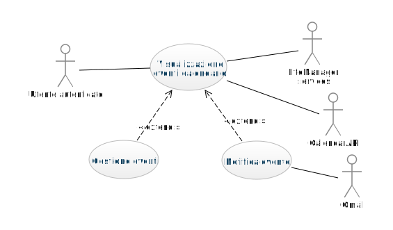

# Descrizione use cases

### 1. Use case diagram - login e registrazione

### UseCase registrazione
   * **Sommario**
        Questo use case descrive come l'utente non autenticato effettua la registrazione nel sistema tramite form.
   * **Descrizione**
       1. L'utente non autenticato inserisce nome [nota1], cognome[nota1], username, email[nota2], password[nota3], conferma password[nota3] e preme sul pulsante "Registrati"[nota4] [nota5].
       2. Il sistema, tramite Gmail, manda una mail di verifica all'indirizzo specificato, premendo nel link presente nella mail viene effettuata la verifica dell'indirizzo email e visualizzato un messaggio di benvenuto.
       3. A registrazione effettuata, si può effettuare il login. 
   * **Note**
       1. Nome e/o cognome non valido (non soddisfano la regex "[a-zA-Z0-9]"), il bordo del campo diventa rosso.
       2. Email non valida (non soddisfa la regex ".+@.+\..+"), il bordo del campo diventa rosso.
       3. Password non valida oppure le due password non sono uguali, il bordo del campo diventa rosso.
       4. Ci sono campi non compilati oppure non validi, il bordo di tali campi diventa rosso.
       5. L'email inserita è già associata ad un altro account, appare la scritta "Email inserita associata ad un altro account, inserire un'altra email".
        

### UseCase login
   * **Sommario**
        Questo use case descrive come l'utente non autenticato effettua il login nel sistema tramite form.
   * **Descrizione**
       1. L'utente non autenticato, se registrato, inserisce username o email e la sua password e conferma premendo su "Accedi", oppure sceglie l'opzione "Accedi con Google" per accedere tramite il proprio accout Google[nota1] [nota2].
       2. A login completato, viene visualizzata la HomePage dell'applicazione.
   * **Note**
       1. Ci sono campi non compilati, il bordo di tali campi diventa rosso.
       2. Dati inseriti non corretti, appare la scritta "Utente non presente nel sistema o password inserita errata".

### UseCase conferma email
   * **Sommario**
        Questo use case descrive come avviene la verifica dell'indirizzo email.
   * **Descrizione**
       1. Il sistema, tramite Gmail, manda una mail di verifica all'indirizzo specificato durante la registrazione, premendo sul link presente nella mail viene effettuata la verifica dell'indirizzo email e visualizzato un messaggio di benvenuto.

### UseCase recupero password
   * **Sommario**
        Questo use case descrive come avviene il recupero della password nel caso in cui l'utente autenticato se la sia dimenticata o voglia modificarla.
   * **Descrizione**
       1. L'utente autenticato clicca sul pulsante "Recupera password".
       2. L'utente autenticato inserisce la sua email[nota1] [nota2] e preme su "Invia email di recupero".
       3. L'email inviata tramite Gmail permetterà all'utente autenticato di impostare una nuova password.
   * **Note**
       1. Campo Email non compilato, il bordo del campo diventa rosso. 
       2. Email inserita non corretta o non associata a nessun accout, appare il messaggio "Email inserita non valida".

### 2. Use case diagram - home page, impostazioni e profilo

### UseCase visualizzazione HomePage
   * **Sommario**
        Questo use case descrive la visualizzazione della home page da parte di un utente autenticato.
   * **Descrizione**
       1. L'utente autenticato visualizza la lista delle schede che corrispondono alle varie funzionalità.
       2. L'utente può cliccare su ognuna delle schede presenti nella home page.
    

### UseCase visualizzazione profilo
   * **Sommario**
      Questo use case descrive la visualizzazione dei dati associati al proprio profilo da parte di un utente autenticato.
   * **Descrizione**
       1. L'utente autenticato visualizza le informazioni relative al proprio profilo, come username, email, foto profilo.[nota1]
   * **Note**
       1. L'utente non è tenuto a specificare una foto profilo, può lasciare l'icona generica (vuota).

### UseCase modifica profilo
   * **Sommario**
      Questo use case descrive come l'utente possa andare a modificare le informazioni associate al proprio profilo.
   * **Descrizione**
      1. L'utente autenticato modifica la foto profilo premendo sull'icona della matita e scegliendo un'immagine a suo piacimento.
      2. L'utente autenticato modifica nome e cognome premendo sull'icona della matita[nota3].
      3. L'utente autenticato preme il pulsante "Modifica profilo" se ha necessità di cambiare username, email [nota1], password [nota2] [nota3] [nota4].
   * **Note**
      1. Email non valida (non soddisfa la regex ".+@.+\..+"), il bordo del campo diventa rosso.
      2. Password non valida oppure le due password non sono uguali, il bordo del campo diventa rosso.
      3. Ci sono campi non compilati oppure non validi, il bordo di tali campi diventa rosso.
      4. L'email inserita è già associata ad un altro account, appare la scritta "Email inserita associata ad un altro account, inserire un'altra email".

### UseCase visualizzazione impostazioni
   * **Sommario**
      Questo use case descrive la visualizzazione delle impostazioni del sistema da parte di un utente autenticato.
   * **Descrizione**
      1. L'utente autenticato visualizza se le notifiche sono attivate o meno premendo sul pulsante "Notifiche".
      2. L'utente autenticato visualizza le informazioni relative a privacy e sicurezza, in particolare l'informativa sul trattamento dei dati personali e la gestione dei cookies, premendo su "Privacy e sicurezza" .
      3. L'utente autenticato visualizza la lingua impostata per il sistema premendo il pulsante "Lingua".
      4. L'utente autenticato visualizza le informazioni generali del sistema, come la versione attuale dell'applicazione e i contatti degli sviluppatori.
   
   

### UseCase gestione impostazioni
   * **Sommario**
      Questo use case descrive come l'utente autenticato effettua modifiche alle impostazioni del sistema premendo sul bottene relativo alla funzionalità/impostazione che vuole modificare.
   * **Descrizione**
      1. L'utente autenticato attiva/disattiva le notifiche.
      2. L'utente autenticato cambia la lingua scegliendo tra una lista di lingue predefinita.
      3. L'utente autenticato può modificare le sue preferenze per la gestione dei cookies.
      4. L'utente autenticato può disconnettersi in modo sicuro [nota1].
   * **Note**
      1. Il sistema visualizza un banner per permettere all'utente di confermare il logout.

### 3. Use case diagram - budget

### UseCase visualizzazione budget
   * **Sommario**
     Questo use case descrive la visualizzazione da parte dell'utente autenticato del proprio budget e le informazioni relative ai propri movimenti.
   * **Descrizione**
      1. L'utente autenticato visualizza una presentazione grafica delle categorie in cui ogni movimento è classificato, relativa al mese corrente.
      2. L'utente autenticato visualizza il riepilogo delle entrate e delle uscite del mese corrente.
      3. L'utente autenticato visualizza l'elenco di tutti i suoi movimenti ordinati in base a quando sono stati inseriti[nota1] e con la possibilità di essere filtrati (tutti o solo mese corrente).
      4. L'utente autenticato può cercare un determinanto movimento premendo il pulsante "Cerca" [nota2].
   * **Note**
      1. Dal più recente a quello meno recente.
      2. La ricerca viene effettuata in base al nome del movimento o delle note associate a esso. 

### UseCase visualizzazione per categoria
   * **Sommario**
       Questo use case descrive la visualizzazione da parte dell'utente autenticato del proprio budget relativo a una determinata categoria e le informazioni sui movimenti associati a tale categoria.
   * **Descrizione**
      1. L'utente autenticato, cliccando sulla categoria che desidera ispezionare, visualizza l'elenco dei movimenti associati a tale categoria [nota1] e con la possibilità di essere filtrati (tutti o solo mese corrente).
      2. L'utente autenticato può cercare un determinato movimento nella lista di movimenti della categoria desiderata con il pulsante "Cerca" [nota2].
   * **Note**
      1. Dal più recente a quello meno recente.
      2. La ricerca viene effettuata in base al nome del movimento o delle note associate a esso.

### UseCase visualizzazione entrate/uscite
   * **Sommario**
      Questo use case descrive la visualizzazione da parte dell'utente autenticato delle proprie entrate o delle proprie uscite.
   * **Descrizione**
      1. L'utente autenticato, cliccando su "Entrate" o su "Uscite", visualizza rispettivamente l'elenco dei movimenti in entrata o l'elenco dei movimenti in uscita [nota1] e con la possibilità di essere filtrati (tutti o solo mese corrente).
      2. L'utente autenticato può cercare un determinato movimento nella lista di movimenti in entrata/uscita con il pulsante "Cerca" [nota2].
   * **Note**
      1. Dal più recente a quello meno recente.
      2. La ricerca viene effettuata in base al nome del movimento o delle note associate a esso.

### UseCase gestione budget
   * **Sommario**
      Questo use case descrive come l'utente autenticato può aggiungere, rimuovere o modificare movimenti e aggiungere, rimuovere o modificare le categorie in cui i movimenti sono classificate.
   * **Descrizione**
      1. L'utente autenticato aggiunge una categoria con il bottone "+" presente nel grafico delle categorie [nota1] [nota8].
      2. L'utente autenticato rimuove o modifica una categoria esistente tenendo premuta tale categoria e selezionando "Modifica" oppure "Rimuovi" [nota2] [nota7].
      3. L'utente autenticato aggiunge un nuovo movimento premendo il pulsante "+" presente nell'elenco dei movimenti, oppure presente nella categoria selezionata o nella sezione "Entrate"/"Uscite" [nota3] [nota5] [nota6] [nota7].
      4. L'utente autenticato rimuove o modifica un movimento esistente tenendo premuta tale categoria e selezionando "Modifica" oppure "Rimuovi" [nota4] [nota5] [nota6] [nota7].
   * **Note**
      1. Nell'aggiunta di una categoria, l'utente autenticato inserisce obbligatoriamente il nome di tale categoria.
      2. Nella modifica di una categoria, l'utente autenticato modifica il nome di tale categoria.
      3. Nell'aggiunta di un movimento, l'utente autenticato inserisce obbligatoriamente titolo, importo, tipologia (entrata o uscita), categoria (tra le categorie presenti) e opzionalmente eventuali note.
      4. Nella modifica di un movimento, l'utente autenticato modifica uno o più campi relativi a tale movimento.
      5. Se l'aggiunta o la modifica di un  movimento avvengono da una scheda relativa ad una categoria specifica, il campo categoria sarà pre-impostato secondo la tale categoria.
      6. Se l'aggiunta o la modifica di un movimento avvengono dalla scheda "Entrate" o dalla scheda "Uscite", il campo tipologia sarà pre-impostato secondo la tale scheda.
      7. I campi titolo, importo, tipologia e categoria non possono essere vuoti, se accade i bordi del campo diventano rossi.
      8. Il campo nome non può essere vuoto, se accade i bordi del campo diventano rossi.

### 4. Use case diagram - liste di interesse

### UseCase visualizzazione liste
   * **Sommario**
      Questo use case descrive la visualizzazione da parte dell'utente autenticato delle proprie liste di interesse [nota1] e la visualizzazione degli elementi presenti in ogni lista se cliccate.
   * **Descrizione**
      1. L'utente autenticato visualizza l'elenco delle proprie liste.
      2. L'utente autenticato può cercare una determinata lista con il pulsante "Cerca" [nota2].
      3. Per ogni lista, l'utente autenticato visualizza l'elenco di elementi appartenenti a tale lista, compresi quelli a cui non è più interessato[nota3]. 
   * **Note**
      1. Le liste predefinite sono: lista della spesa, to_do_list e altro.
      2. La ricerca avviene secondo il nome della lista. 
      3. Gli elementi a cui non è più interessato sono contrassegnati con un box e appaiono sbarrati e sbiaditi.

   

### UseCase gestione liste
   * **Sommario**
      Questo use case descrive come l'utente autenticato può aggiungere, rimuovere o modificare liste, e per ogni lista può aggiungere, rimuovere o modificare gli elementi.
   * **Descrizione**
      1. L'utente autenticato aggiunge una lista con il bottone "+" presente nella scheda Liste [nota1] [nota6].
      2. L'utente autenticato rimuove o modifica una lista esistente tenendo premuta tale lista e selezionando "Modifica" oppure "Rimuovi" [nota2] [nota6].
      3. Per ogni lista, l'utente autenticato aggiunge uno o più elementi alla lista[nota3] [nota6].
      4. Per ogni lista, l'utente autenticato modifica o rimuove un elemento esestente nella lista e tenendo premuto tale elemento e selezionando "Modifica" oppure "Rimuovi" [nota4] [nota6].
      5. L'utente autenticato contrassegna gli elementi della lista una volta che non ne ha più bisogno; per farlo, clicca sul box in fianco all'elemento che vuole contrassegnare[nota5].
      6. L'utente svuota la lista quando non è più interessato agli elementi in tale lista.
   * **Note**
      1. Nell'aggiunta di una lista, l'utente autenticato inserisce obbligatoriamente il nome di tale lista.
      2. Nella modifica di una lista, l'utente autenticato modifica il nome di tale lista.
      3. Nell'aggiunta di un elemento di una lista, l'utente autenticato inserisce obbligatoriamente il nome di tale elemento.
      4. Nella modifica di un elemento di una lista, l'utente autenticato modifica il nome di tale elemento.
      5. Gli elementi contrassegnati verranno barrati e sbiaditi nell'elenco degli elementi.
      6. I campi nome di liste o elementi non possono essere vuoti, se accade i bordi del campo diventano rossi.

### 5. Use case diagram - eventi 

### UseCase visualizzazione eventi/calendario
   * **Sommario**
      Questo use case descrive la visualizzazione da parte dell'utente autenticato dei propri eventi o impegni in un calendario [nota1] e la visualizzazione dei dettagli di ogni evento se cliccato.
   * **Descrizione**
      1. L'utente autenticato visualizza il calendario con segnalati i propri eventi.
      2. Per ogni evento, l'utente autenticato visualizza i dettagli relativi a tale evento [nota2]. 
   * **Note**
      1. Calendario fornito da ...
      2. I dettagli comprendono titolo, note, giorno, orari di inizio e fine (o tutto il giono) in cui accade.

### UseCase gestione eventi
   * **Sommario**
      Questo use case descrive come l'utente autenticato può aggiungere, rimuovere o modificare eventi nel calendario. 
   * **Descrizione**
      1. L'utente autenticato aggiunge un nuovo evento cliccando su un giorno del calendario[nota1] oppure con il bottone "Aggiungi evento" [nota2] [nota4].
      2. L'utente autenticato modifica o rimuove un evento esistente dal calendario tenendo premuto tale elemento e selezionando "Modifica" oppure "Rimuovi" [nota3] [nota4].
   * **Note**
      1. La data del giorno selezionato sarà pre-impostata nella scheda di aggiunta di un evento. 
      2. Nell'aggiunta di un evento, l'utente autenticato inserisce obbligatoriamente titolo, la data, giorno e ora di inizio e fine (o se tutto il giorno contrassegna il box "Tutto il giorno") e opzionalmente inserisce delle note relative a quell'evento.
      3. Nella modifica di un evento, l'utente autenticato modifica uno o più campi relativi all'evento.
      4. I campi relativi a titolo data e ora di inizio e fine (o tutto il giorno) non possono essere vuoti, se accade il bordo di tali campi diventa rosso.

### UseCase notifica evento
   * **Sommario**
      Questo use case descrive come l'utente autenticato attiva la notifica di un evento.
   * **Descrizione**
      1. L'utente autenticato, se desidera ricevere una notifica per ricordargli di un determinato evento, contrassegna il box "Notifica"[nota1].
   * **Note**
      1. Se contrassegnato il box, l'utente autenticato potrà anche scegliere quanto prima vuole ricevere la notifica.

### 6. Use case diagram - ricette

### UseCase visualizzazione ricette
   * **Sommario**
      Questo use case descrive la visualizzazione da parte dell'utente autenticato della propria lista di ricette e la visualizzazione dettagliata di una singola ricetta se cliccata.
   * **Descrizione**
      1. L'utente autenticato visualizza un elenco con le proprie ricette.
      2. L'utente autenticato può cercare una determinata ricetta con il pulsante "Cerca" [nota1].
      3. Per ogni ricetta, l'utente autenticato visualizza i dettagli di tale ricetta [nota2].
   * **Note**
      1. La ricerca avviene secondo il titolo della ricetta.
      2. I dettagli della ricetta comprendono titolo, ingredienti, procendimento. 

### UseCase gestione ricette
   * **Sommario**
      Questo use case descrive come l'utente autenticato può aggiungere, rimuovere o modificare le proprie ricette.
   * **Descrizione**
      1. L'utente autenticato aggiunge una ricetta con il bottone "+" presente nella scheda Ricette [nota1] [nota3].
      2. L'utente autenticato rimuove o modifica una ricetta esistente tenendo premuta tale ricetta nella lista e selezionando "Modifica" oppure "Rimuovi" [nota2] [nota3].
   * **Note**
      1. Nell'aggiunta di una nuova ricetta, l'utente autenticato inserisce obbigatoriamente un titolo e uno o più ingredienti e opzionalmente la descrizione del procedimento.
      2. Nella modifica di una ricetta, l'utente autenticato modifica uno o più campi riguardanti la ricetta.
      3. I campi relativi a titolo e ingredienti non possono essere vuoti, se accade il bordo di tali campi diventa rosso.

### UseCase aggiungi a lista spesa
   * **Sommario**
      Questo use case descrive l'aggiunta da parte dell'utente autenticato di ingredienti della ricetta direttamente alla lista della spesa.
   * **Descrizione**
      1. L'utente autenticato può aggiungere tutti gli ingredienti di una ricetta alla lista della spesa con il pulsante "Aggiungi a lista della spesa".
      2. Per ogni ricetta, l'utente autenticato può aggiungere gli ingredienti che desidera alla lista della spesa tenendo premuta tali ingredienti e selezionando "Aggiungi a lista della spesa". 

### 7. Use case diagram - mappa e luoghi di interesse

### UseCase visualizzazione mappa/luoghi
   * **Sommario**
      Questo use case descrive la visualizzazione da parte dell'utente autenticato della mappa contenente dei riferimenti a luoghi di interesse e la lista di questi luoghi.
   * **Descrizione**
      1. L'utente autenticato visualizza la mappa con segnalati i propri luoghi di interesse[nota1].
      2. L'utente autenticato visualizza l'elenco dei propri luoghi di interesse[nota2].
      3. L'utente autenticato può cercare un determinato luogo di interesse con il pulsante "Cerca" [nota3].
   * **Note**
      1. La mappa è fornita da ...
      2. L'elenco è ordinato cronologicamente in base a quando è stato inserito il luogo di interesse.
      3. La ricerca avviene secondo il nome associato al luogo di interesse.

### UseCase gestione luoghi di interesse
   * **Sommario**
      Questo use case descrive come l'utente autenticato può aggiungere, rimuovere o modificare i propri luoghi di interesse.
   * **Descrizione**
      1. L'utente autenticato aggiunge un nuovo luogo di interesse con il bottone "+" presente nella scheda Ricette [nota1] [nota4] [nota5].
      2. Opzionalmente, l'utente autenticato aggiunge un nuovo luogo di interesse cliccandolo direttamente sulla mappa [nota2].
      3. L'utente autenticato rimuove o modifica un luogo di interesse esistente tenendo premuto tale luogo nell'elenco e selezionando "Modifica" oppure "Rimuovi" [nota3] [nota4] [nota5].
   * **Note**
      1. Nell'aggiunta di un nuovo luogo di interesse, l'utente autenticato inserisce obbigatoriamente un nome, un indirizzo e la città, e opzionalmente la categoria relativa al luogo.
      2. I campi relativi al luogo selezionato verranno, se possibile, auto-compilati.
      3. Nella modifica di un luogo di interesse, l'utente autenticato modifica uno o più campi riguardanti tale luogo.
      4. I campi relativi a nome e indirizzo non possono essere vuoti, se accade il bordo di tali campi diventa rosso.
      5. Nel caso in cui l'indirizzo inserito non sia corretto o valido, il bordo del campo si colora di rosso.

### UseCase visualizzazione posizione
   * **Sommario**
      Questo use case descrive la visualizzazione da parte dell'utente autenticato della propria posizione nella mappa.
   * **Descrizione**
      1. L'utente autenticato visualizza la propia posizione sulla mappa tramite segnalibro[nota1] [nota2].
   * **Note**
      1. La posizione è fornita dal GPS del dispositivo.
      2. La mappa è fornita da ...

### 8. Use case diagram - carte fedeltà

### UseCase visualizzazione carte fedeltà
   * **Sommario**
      Questo use case descrive la visualizzazione da parte dell'utente autenticato della lista delle proprie carte fedeltà e dei dettagli di ogni carta.
   * **Descrizione**
      1. L'utente autenticato visualizza una lista delle proprie carte fedeltà[nota1].
      2. Per ogni carta fedeltà, l'utente autenticato visualizza il nome o l'organizzazione a cui la carta è associata e il codice a barre associato alla carta[nota2].
      3. L'utente autenticato può cercare una determinata carta fedeltà con il pulsante "Cerca" [nota3].
   * **Note**
      1. La lista è ordinata cronologicamente in base alla data di inserimento.
      2. Il codice a barre è generato automaticamente in base al numero della carta.
      3. La ricerca avviene secondo il nome associato alla carta.

### UseCase gestione carte fedeltà
   * **Sommario**
       Questo use case descrive come l'utente autenticato può aggiungere, rimuovere o modificare le proprie carte fedeltà.
   * **Descrizione**
      1. L'utente autenticato aggiunge una nuova carta fedeltà con il bottone "+" presente nella scheda Carte Fedeltà [nota1] [nota3] [nota4].
      2. L'utente autenticato rimuove o modifica una carta fedeltà esistente tenendo premuto tale carta nell'elenco e selezionando "Modifica" oppure "Rimuovi" [nota2] [nota3] [nota4].
   * **Note**
      1. Nell'aggiunta di un nuova carta fedeltà, l'utente autenticato inserisce obbigatoriamente nome e numero della carta.
      2. Nella modifica di una carta fedeltà, l'utente autenticato modifica uno o più campi riguardanti tale carta.
      3. I campi relativi a nome e numero carta non possono essere vuoti, se accade il bordo di tali campi diventa rosso.
      4. Nel caso in cui il numero della carta inserito non sia corretto o valido, il bordo del campo si colora di rosso.